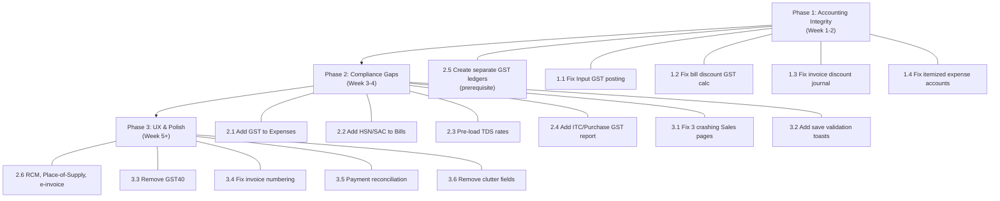

# HAI Accounting — CA Audit Bug Fix & Compliance Implementation Plan

> **Purpose**: This document is a structured implementation guide for an AI agent (or developer) to fix all defects identified during a Chartered Accountant's end-to-end audit of the HAI Accounting application. **No code changes have been made** — this is analysis only.
>
> **Priority**: Bugs are ordered by severity. Phase 1 items are accounting-integrity defects that produce incorrect financial statements. Phase 2 items are compliance gaps. Phase 3 items are UX/validation issues.
>
> **Audit Date**: July 2026 | **Auditor**: CA Review | **Scope**: Purchases (Vendors, Bills, Expenses, POs) and Sales (Invoices, Customers, Quotes, Credit Notes)

---

## Table of Contents

1. [Phase 1 — Critical Accounting Integrity (MUST FIX)](#phase-1--critical-accounting-integrity-must-fix)
   - [1.1 Input GST Posted to Wrong Ledger](#11-input-gst-posted-to-wrong-ledger-tax-payable-instead-of-input-tax-credit)
   - [1.2 GST Calculated on Pre-Discount Amount (Bills)](#12-gst-calculated-on-pre-discount-amount-bills)
   - [1.3 Sales Invoice Discount Corrupts Journal Entry](#13-sales-invoice-line-discount-corrupts-journal-entry)
   - [1.4 Itemized Expense Loses Account Selection](#14-itemized-expense-loses-account-selection-on-save)
2. [Phase 2 — Compliance Gaps](#phase-2--compliance-gaps)
   - [2.1 No GST Field on Expense Module](#21-no-gst-field-on-expense-module)
   - [2.2 HSN/SAC Code Missing at Transaction Line Level](#22-hsnsac-code-missing-at-transaction-line-level)
   - [2.3 TDS Rates Default to 0%](#23-tds-rates-default-to-0)
   - [2.4 No Purchase-Side GST Report](#24-no-purchase-side-gst-reportitc-register)
   - [2.5 Separate Input/Output GST Ledgers](#25-separate-inputoutput-gst-ledgers)
   - [2.6 Missing RCM, Place-of-Supply Auto-Logic, E-Invoice Fields](#26-missing-rcm-place-of-supply-auto-logic-e-invoice-fields)
3. [Phase 3 — UX, Validation & Crashes](#phase-3--ux-validation--crashes)
   - [3.1 Three Sales List Pages Crash (Customers, Quotes, Credit Notes)](#31-three-sales-list-pages-crash-customers-quotes-credit-notes)
   - [3.2 Save Fails Silently with No Validation Message](#32-save-fails-silently-with-no-validation-message)
   - [3.3 GST40 Slab in Tax List](#33-gst40-40-slab-in-tax-list)
   - [3.4 Invoice Numbering Inconsistency](#34-invoice-numbering-inconsistency)
   - [3.5 Payment-Receipt Reconciliation Mismatch](#35-payment-receipt-reconciliation-mismatch)
   - [3.6 Minor Clutter Fields](#36-minor-clutter-fields-vendor-language-fax)
4. [What Already Works Well](#what-already-works-well)
5. [Testing Checklist](#testing-checklist)

---

## Phase 1 — Critical Accounting Integrity (MUST FIX)

These defects produce **incorrect financial statements and GST returns**. They must be resolved before the application can be relied upon for real bookkeeping.

---

### 1.1 Input GST Posted to Wrong Ledger ("Tax Payable" Instead of "Input Tax Credit")

| Field | Detail |
|---|---|
| **Severity** | 🔴 CRITICAL |
| **Module** | Purchases → Bills |
| **Symptom** | When a bill with GST is saved (e.g., BILL-00002: ₹5,000 + ₹900 GST = ₹5,900), the journal entry shows: `DR Office Supplies ₹5,000` / `CR Accounts Payable ₹5,900` — the ₹900 GST debit line is **missing** from the bill journal view. In the Trial Balance, the GST amount is being **credited** to a single `Tax Payable` liability account. |
| **Root Cause** | The bill journal-creation logic routes all GST (both input and output) to a single `Tax Payable` account as a **credit**. For purchases, input GST should be a **debit** to an asset account (Input CGST / Input SGST / Input IGST). |
| **Impact** | (1) No Input Tax Credit (ITC) asset on the Balance Sheet. (2) GST liability is understated because purchase tax nets against output tax. (3) The bill-level journal doesn't even display the tax line to the user. (4) GSTR-3B ITC computation would be wrong. |

**Where to investigate (backend)**:
```
backend/
├── controllers/   → Look for bill creation / save handler
├── models/        → Bill model, Journal Entry model
├── services/      → Journal entry auto-posting logic for bills
└── routes/        → Bill routes (POST / PUT)
```

Search for:
- `Tax Payable` string references — find where this account is resolved
- Journal entry creation function used when a bill is saved
- Any `journalEntry.push()` or equivalent that builds debit/credit lines

**Expected Fix**:
1. When creating a bill journal, for each tax line:
   - Look up or create `Input CGST`, `Input SGST`, `Input IGST` accounts (Asset type, under "Other Current Asset")
   - **Debit** the input tax account (not credit "Tax Payable")
2. The journal should have 3+ lines:
   ```
   DR  Expense Account (e.g., Office Supplies)     ₹5,000
   DR  Input CGST                                    ₹450
   DR  Input SGST                                    ₹450
   CR  Accounts Payable                             ₹5,900
   ```
3. Ensure the tax lines are **visible** in the bill's journal view on the frontend

**Test Case**:
```
GIVEN: A bill with 10 × ₹500 = ₹5,000, GST 18% (intra-state)
WHEN: Bill is saved as "Open"
THEN:
  ✅ Journal shows 4 lines: Expense DR ₹5,000, Input CGST DR ₹450, Input SGST DR ₹450, AP CR ₹5,900
  ✅ Trial Balance shows Input CGST and Input SGST as debit balances
  ✅ "Tax Payable" is NOT affected by purchase GST
  ✅ All lines visible in bill's journal tab
```

---

### 1.2 GST Calculated on Pre-Discount Amount (Bills)

| Field | Detail |
|---|---|
| **Severity** | 🔴 CRITICAL |
| **Module** | Purchases → Bills |
| **Symptom** | A two-line bill of ₹1,39,000 with 10% discount (₹13,900) computes GST of ₹25,020 (18% of ₹1,39,000) instead of ₹22,518 (18% of ₹1,25,100). |
| **Root Cause** | The tax calculation function applies the tax rate to the **gross** line total before subtracting the discount. |
| **Legal Basis** | Section 15 of CGST Act: when a discount is shown on the invoice at the time of supply, GST must be charged on the **net value after discount**. |

**Where to investigate**:
```
client/components/bill-form.tsx
  → Look for the tax/total calculation logic
  → Search for: discount, taxAmount, subTotal, lineTotal
  → The calculation likely does: taxAmount = lineTotal * taxRate
  → It should do: taxAmount = (lineTotal - discount) * taxRate

backend/ (if tax is recalculated server-side on save)
  → Bill controller / service that computes final amounts
```

**Expected Fix**:
```javascript
// BEFORE (buggy):
const taxableAmount = quantity * rate;  // ignores discount
const taxAmount = taxableAmount * (taxRate / 100);

// AFTER (correct):
const grossAmount = quantity * rate;
const discountAmount = /* line discount or percentage */;
const taxableAmount = grossAmount - discountAmount;
const taxAmount = taxableAmount * (taxRate / 100);
```

**Test Case**:
```
GIVEN: Bill line: 1 × ₹1,00,000, discount 10% (₹10,000), GST 18%
WHEN: Tax is calculated
THEN:
  ✅ Taxable value = ₹90,000
  ✅ CGST = ₹8,100, SGST = ₹8,100
  ✅ Total = ₹1,06,200 (NOT ₹1,08,000)
```

---

### 1.3 Sales Invoice Line-Discount Corrupts Journal Entry

| Field | Detail |
|---|---|
| **Severity** | 🔴 CRITICAL |
| **Module** | Sales → Invoices |
| **Symptom** | Invoice of 2 × ₹10,000 with 10% line discount and 18% GST. **On-screen** calculation is correct: net ₹18,000 + GST ₹3,240 = ₹21,240. But the **journal** records: `DR AR ₹21,240` / `CR Sales ₹20,000` (pre-discount!) / `CR Tax Payable ₹1,240` (plugged to balance). Revenue is overstated by ₹2,000 and output GST is understated by ₹2,000. |
| **Root Cause** | The invoice journal-posting function uses the gross `quantity × rate` for the Sales credit line instead of the net-of-discount amount. It then computes `Tax Payable` as a balancing figure (`total - sales`) rather than using the actual tax amount from the invoice. |
| **Impact** | (1) Revenue overstated in P&L. (2) Output GST in books (₹1,240) ≠ GST on invoice (₹3,240) — GSTR-1 vs GSTR-3B mismatch. (3) Potential GST demand + interest from tax authorities. |

**Where to investigate**:
```
backend/
  → Invoice save / create controller
  → Journal entry auto-posting for invoices
  → Search for: "Sales", revenue posting, discount handling in journal lines
  → Look for where lineTotal is computed for the journal credit — it likely uses
    (qty * rate) instead of (qty * rate - discount)

client/app/sales/invoices/new/page.tsx
  → The on-screen calculation is CORRECT, so the frontend math is fine
  → The bug is in the backend journal posting
```

**Expected Fix**:
The invoice journal should be:
```
DR  Accounts Receivable          ₹21,240
CR  Sales / Revenue              ₹18,000  (net of discount)
CR  Output CGST                   ₹1,620
CR  Output SGST                   ₹1,620
```
Optionally, if a "Sales Discount" ledger is desired:
```
DR  Accounts Receivable          ₹21,240
DR  Sales Discount                ₹2,000
CR  Sales (Gross)                ₹20,000
CR  Output CGST                   ₹1,620
CR  Output SGST                   ₹1,620
```

**Test Case**:
```
GIVEN: Invoice: 2 × ₹10,000, 10% line discount, 18% GST (intra-state)
WHEN: Invoice is saved
THEN:
  ✅ Journal: Sales CR = ₹18,000 (not ₹20,000)
  ✅ Journal: Tax CR = ₹3,240 (not ₹1,240)
  ✅ Trial Balance: Sales balance increases by ₹18,000
  ✅ Trial Balance: Tax Payable increases by ₹3,240
  ✅ Invoice without discount still posts correctly (regression test)
```

---

### 1.4 Itemized Expense Loses Account Selection on Save

| Field | Detail |
|---|---|
| **Severity** | 🟠 HIGH |
| **Module** | Purchases → Expenses (Itemized view) |
| **Symptom** | When recording an expense using the "Itemize" view and selecting "Advertising and Marketing" as the line account, on saving the expense listing shows a blank account and the journal posts the debit to a generic "Expense Account" instead. The **single (non-itemized)** expense view works correctly. |
| **Root Cause** | The itemized expense form likely doesn't include the line-level `account_id` in the POST/PUT payload, or the backend doesn't read it from the itemized lines array. |

**Where to investigate**:
```
client/components/expense-form.tsx
  → Search for the itemized form state (likely an array of line objects)
  → Check if each line's account_id is included in the save payload
  → Compare with the single-expense save path which works correctly

backend/
  → Expense controller — check if it reads line-level accounts from the itemized payload
  → Expense model — check if line items have an account field
```

**Expected Fix**:
Ensure each itemized line's `account_id` / `expense_account` is:
1. Included in the frontend POST payload
2. Read and persisted by the backend
3. Used in the journal entry (one debit line per unique account)

**Test Case**:
```
GIVEN: Itemized expense with 2 lines:
  Line 1: "Advertising and Marketing" — ₹5,000
  Line 2: "Office Supplies" — ₹3,000
WHEN: Expense is saved
THEN:
  ✅ Expense listing shows correct accounts per line
  ✅ Journal: DR Advertising ₹5,000, DR Office Supplies ₹3,000, CR Cash/Bank ₹8,000
  ✅ Trial Balance: Both expense accounts increase correctly
```

---

## Phase 2 — Compliance Gaps

These are missing features required for Indian MSME GST/TDS compliance. The system works without them but cannot produce fully compliant returns.

---

### 2.1 No GST Field on Expense Module

| Field | Detail |
|---|---|
| **Severity** | 🟠 HIGH |
| **Module** | Purchases → Expenses |
| **Symptom** | The "Record Expense" form (both single and itemized) has columns for Expense Account, Notes, and Amount — but **no tax/GST field**. Users cannot capture CGST/SGST/IGST breakup on direct expenses, so ITC cannot be claimed through the Expense screen. |
| **Workaround** | Currently, any GST-bearing purchase must be routed through "Bills" instead. |

**Where to investigate**:
```
client/components/expense-form.tsx
  → The form layout — add a Tax dropdown (reuse the tax selector from bill-form.tsx)
  
backend/
  → Expense model — add tax fields (taxId, taxAmount, cgst, sgst, igst)
  → Expense controller — include tax in journal posting
```

**Expected Fix**:
Add a "Tax" dropdown column to both the single and itemized expense forms, reusing the same GST tax groups available in the Bill form. On save, compute and post the tax to Input CGST/SGST/IGST accounts.

**Test Case**:
```
GIVEN: Expense: ₹10,000 for "Office Supplies" with GST 18%
WHEN: Expense is saved
THEN:
  ✅ Tax fields show CGST ₹900 + SGST ₹900
  ✅ Total = ₹11,800
  ✅ Journal: DR Office Supplies ₹10,000, DR Input CGST ₹900, DR Input SGST ₹900, CR Cash ₹11,800
```

---

### 2.2 HSN/SAC Code Missing at Transaction Line Level

| Field | Detail |
|---|---|
| **Severity** | 🟡 MEDIUM |
| **Module** | Purchases → Bills, Expenses |
| **Symptom** | HSN/SAC code is captured on Sales invoices (good!) but NOT on Bill or Expense line items. HSN/SAC reporting is mandatory in GSTR-1 and on tax invoices above turnover thresholds. |
| **Note** | The Sales invoice already has HSN/SAC — check if it flows from the item master. If so, the same logic should be applied to Bills. |

**Where to investigate**:
```
client/components/bill-form.tsx → Add HSN/SAC column to line items
backend/models/ → Bill line item schema — add hsnCode field
```

---

### 2.3 TDS Rates Default to 0%

| Field | Detail |
|---|---|
| **Severity** | 🟡 MEDIUM |
| **Module** | Purchases → Bills, Vendor Master |
| **Symptom** | TDS sections (194C, 194H, 194I, etc.) exist in the UI but all rates are 0%. Selecting "194C" on a ₹1,39,000 bill deducted ₹0.00. |
| **Expected** | Pre-load statutory default rates: 194C (1% individual / 2% others), 194H (5%), 194I (2%/10%), 194J (2%/10%), 194A (10%), etc. |

**Where to investigate**:
```
client/lib/api/tds-taxes.ts → Check the TDS section definitions and default rates
backend/ → TDS rate configuration / seed data
Settings → /settings/taxes → "Manage TDS" section
```

**Expected Fix**:
Pre-populate the TDS master with current statutory rates from the Income Tax Act. Allow user override but never default to 0%.

---

### 2.4 No Purchase-Side GST Report/ITC Register

| Field | Detail |
|---|---|
| **Severity** | 🟡 MEDIUM |
| **Module** | Reports |
| **Symptom** | The Reports Center has 32 reports but only one GST report: "HSN-wise Summary (GSTR-1/GSTR-3B)" which is outward-supply only. Running it shows zero data for purchases. There is no ITC register, no GSTR-2A/2B reconciliation view. |

**Where to investigate**:
```
client/app/reports/ → Report definitions and templates
client/app/reports/_lib/report-definitions.ts → Add new report entries
backend/ → Report generation APIs
```

**Expected Fix**:
Add at minimum:
1. **Input Tax Credit Register** — list all purchase GST with bill number, vendor GSTIN, tax amounts
2. **GSTR-3B Summary** — output tax minus input tax = net liability
3. **Purchase Register** — all bills with vendor, GSTIN, taxable value, tax breakup

---

### 2.5 Separate Input/Output GST Ledgers

| Field | Detail |
|---|---|
| **Severity** | 🟠 HIGH |
| **Module** | Chart of Accounts / Journal Engine |
| **Symptom** | Currently a single "Tax Payable" account is used for both purchase input GST and sales output GST. This makes ITC tracking impossible and nets different types of tax obligations. |

**Expected Fix**:
Create (or auto-create on first use) these system accounts:
```
Assets → Other Current Asset:
  - Input CGST
  - Input SGST  
  - Input IGST

Liabilities → Other Current Liability:
  - Output CGST
  - Output SGST
  - Output IGST
```
Update all journal-posting logic:
- **Bills/Expenses** → debit Input CGST/SGST/IGST
- **Invoices/Sales** → credit Output CGST/SGST/IGST
- Remove or deprecate the generic "Tax Payable" for GST purposes

---

### 2.6 Missing RCM, Place-of-Supply Auto-Logic, E-Invoice Fields

| Field | Detail |
|---|---|
| **Severity** | 🟢 LOW (future enhancement) |
| **Items** | (a) Reverse Charge Mechanism (RCM) flag on bills. (b) Place-of-supply / GST treatment selector (Registered/Unregistered/Composition/SEZ) that auto-decides CGST+SGST vs IGST. (c) E-invoice/IRN and e-way bill linkage. (d) Round-off field on invoices/bills. |

These are important for full GST compliance but are **enhancements** rather than bugs. Prioritize after Phase 1 and the core Phase 2 items.

---

## Phase 3 — UX, Validation & Crashes

---

### 3.1 Three Sales List Pages Crash (Customers, Quotes, Credit Notes)

| Field | Detail |
|---|---|
| **Severity** | 🔴 CRITICAL (UX) |
| **Module** | Sales → Customers, Quotes, Credit Notes |
| **Symptom** | All three pages throw a fatal client-side crash: "Application error: a client-side exception has occurred." Console shows React error #310 ("rendered more hooks than expected"). Reproducible on fresh reload. |
| **Impact** | Users cannot access their customer master list, view quotes, or manage credit notes. |

**Where to investigate**:
```
client/app/sales/customers/page.tsx
client/app/sales/quotes/page.tsx  (or quotes/[id]/page.tsx)
client/app/sales/credit-notes/page.tsx

→ React error #310 means a component is conditionally calling hooks
→ Look for: hooks inside if/else blocks, early returns before all hooks are called,
   or useMemo/useEffect/useState after a conditional return
```

**Expected Fix**:
Move all `useState`, `useEffect`, `useMemo`, `useCallback` calls to the top of each component function, before any conditional `return` statements (including loading/auth guard returns).

**Test Case**:
```
GIVEN: User navigates to /sales/customers
WHEN: Page loads
THEN:
  ✅ Customer list renders without crash
  ✅ Same for /sales/quotes and /sales/credit-notes
```

---

### 3.2 Save Fails Silently with No Validation Message

| Field | Detail |
|---|---|
| **Severity** | 🟠 HIGH |
| **Module** | Bills, Expenses (likely others) |
| **Symptom** | Clicking "Save" does nothing — no error toast, no network call, no visual feedback. Happens when: (a) an empty auto-added line row exists, (b) a required field (like line-item Account) is missing. |

**Where to investigate**:
```
client/components/bill-form.tsx → The save/submit handler
  → Look for early returns with no toast.error()
  → Search for validation checks that return silently

client/components/expense-form.tsx → Same pattern
```

**Expected Fix**:
For every validation check that prevents save, add a visible `toast.error("...")` message:
```javascript
// BEFORE:
if (lines.some(l => !l.account)) return;  // silent fail

// AFTER:
if (lines.some(l => !l.account)) {
  toast.error("Please select an account for all line items.");
  return;
}
```

Specific messages needed:
- `"Please complete or remove empty line items."`
- `"Account is required for each line item."`
- `"Vendor is required."`
- `"At least one line item is required."`

---

### 3.3 GST40 (40%) Slab in Tax List

| Field | Detail |
|---|---|
| **Severity** | 🟢 LOW |
| **Module** | Tax Configuration |
| **Symptom** | "GST40" (40%) appears in the tax dropdown. This is not a current standard GST slab in India and may confuse users. |

**Where to investigate**:
```
backend/ → Tax seed data or tax master configuration
client/lib/api/ → Tax-related API definitions
Settings → /settings/taxes
```

**Expected Fix**: Remove GST40 from the default tax list, or clearly mark it as a custom/non-standard rate.

---

### 3.4 Invoice Numbering Inconsistency

| Field | Detail |
|---|---|
| **Severity** | 🟢 LOW |
| **Module** | Sales → Invoices |
| **Symptom** | New invoice became "INV-000001" while existing one was "INV-000001INV-2026-001" — duplicated sequence prefix. |

**Where to investigate**:
```
backend/ → Invoice number generation logic
  → Search for: invoiceNumber, autoNumber, sequence, INV-
```

---

### 3.5 Payment-Receipt Reconciliation Mismatch

| Field | Detail |
|---|---|
| **Severity** | 🟡 MEDIUM |
| **Module** | Sales → Payments Received |
| **Symptom** | An invoice marked "Paid" for ₹3,51,050 but the Payments Received list shows zero receipts and ₹0 collected. |

**Where to investigate**:
```
backend/ → Payment received listing API
  → Check if the payment was created as an opening balance vs a regular payment
  → Check if the payments-received list query filters correctly
```

---

### 3.6 Minor Clutter Fields (Vendor Language, Fax)

| Field | Detail |
|---|---|
| **Severity** | 🟢 LOW |
| **Module** | Vendor Master |
| **Symptom** | "Vendor Language" field has little practical use for domestic MSME. "Fax Number" fields in address tab are obsolete. |

**Recommendation**: Consider hiding or deprioritizing these fields in the UI. They don't hurt compliance but add clutter.

---

## What Already Works Well

> [!TIP]
> These areas are solid and should NOT be refactored during the bug-fix effort:

| Area | Assessment |
|---|---|
| **Vendor Master** | Excellent — GSTIN with portal prefill, PAN, MSME flag (Sec 43B(h)), TDS section mapping, place-of-supply State, multi-currency |
| **GST Tax Engine (structure)** | Correct slab coverage (0, 5, 12, 18, 28), CGST/SGST vs IGST distinction |
| **Purchase Order Module** | AI document scanning, item-master integration with live stock, project tagging, PO-to-bill tracking, auto Draft Fixed Asset creation |
| **Sales Invoice Format** | Proper Indian tax invoice — HSN/SAC, inter-state IGST logic, HSN-wise summary, amount in words, e-way bill fields |
| **Sales Invoice Journal (no discount)** | Textbook-perfect — AR debit, Sales + Tax credit, auto COGS + Inventory entries |
| **Arithmetic Engine** | Quantity × rate, Indian number formatting (lakhs), adjustment fields — all correct |
| **Auto-Numbering** | Works for Bills (BILL-00002), POs (PO-00001), etc. |
| **Single Expense Save** | Works correctly — posted to right ledger, visible in Trial Balance |

---

## Testing Checklist

After implementing fixes, run these end-to-end tests:

### Purchase Tests
- [ ] **Bill without discount**: Save, check journal has Input CGST/SGST debits, verify Trial Balance
- [ ] **Bill with 10% discount**: Verify GST computed on post-discount amount
- [ ] **Bill with IGST** (inter-state): Verify Input IGST debit (not CGST+SGST)
- [ ] **Itemized expense**: Select different accounts per line, save, verify journal posts to correct accounts
- [ ] **Expense with GST** (after adding tax field): Verify ITC posting
- [ ] **Bill with TDS 194C**: Verify TDS deducted at statutory rate (1% or 2%)
- [ ] **Silent validation**: Try saving bill with empty line → expect toast error

### Sales Tests
- [ ] **Invoice without discount**: Verify journal still posts correctly (regression)
- [ ] **Invoice with 10% line discount**: Verify Sales CR = net amount, Tax CR = correct GST
- [ ] **Customers list page**: Loads without crash
- [ ] **Quotes list page**: Loads without crash
- [ ] **Credit Notes list page**: Loads without crash

### Cross-Module Tests
- [ ] **Trial Balance**: After purchase bill + sales invoice with discounts, verify all balances
- [ ] **Input CGST/SGST/IGST**: Appear as debit balances under Assets
- [ ] **Output CGST/SGST/IGST**: Appear as credit balances under Liabilities
- [ ] **"Tax Payable"**: No longer receives purchase input GST

### Reports Tests
- [ ] **ITC Register** (after adding): Shows all purchase GST with vendor GSTIN
- [ ] **HSN-wise Summary**: Shows purchase-side HSN data (after adding HSN to bills)

---

## Implementation Order Summary



---

> [!IMPORTANT]
> **For the implementing agent**: Start with **2.5** (creating separate GST ledgers) as it is a prerequisite for both 1.1 and 1.3. Then do 1.1 → 1.2 → 1.3 → 1.4 in sequence, running the test cases after each fix. Do NOT attempt to fix multiple journal-engine bugs simultaneously — each one should be verified independently before moving on.

> [!CAUTION]
> **Test data exists**: The auditor created test records during review (2 vendors, 3 bills, 2 expenses, 1 PO, 1 invoice). These should be cleaned up or clearly marked as test data before any production use.
