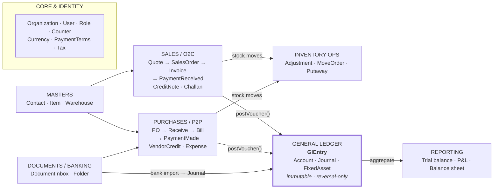
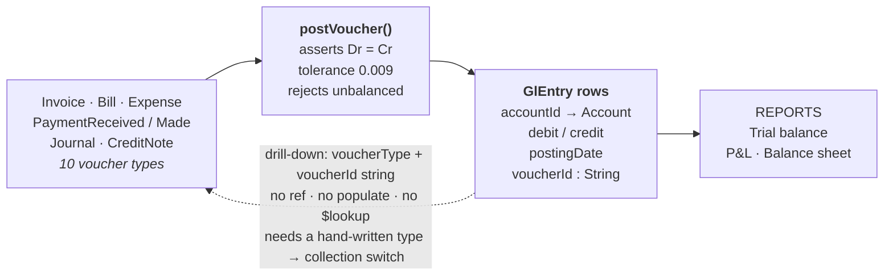
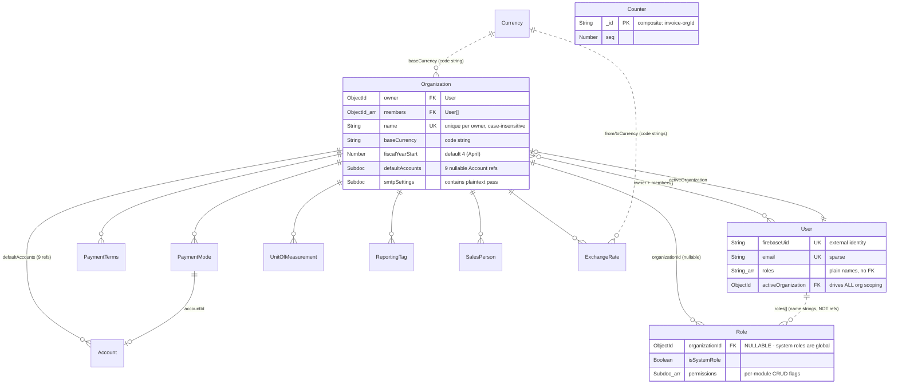
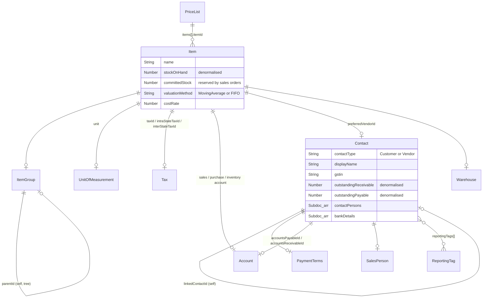
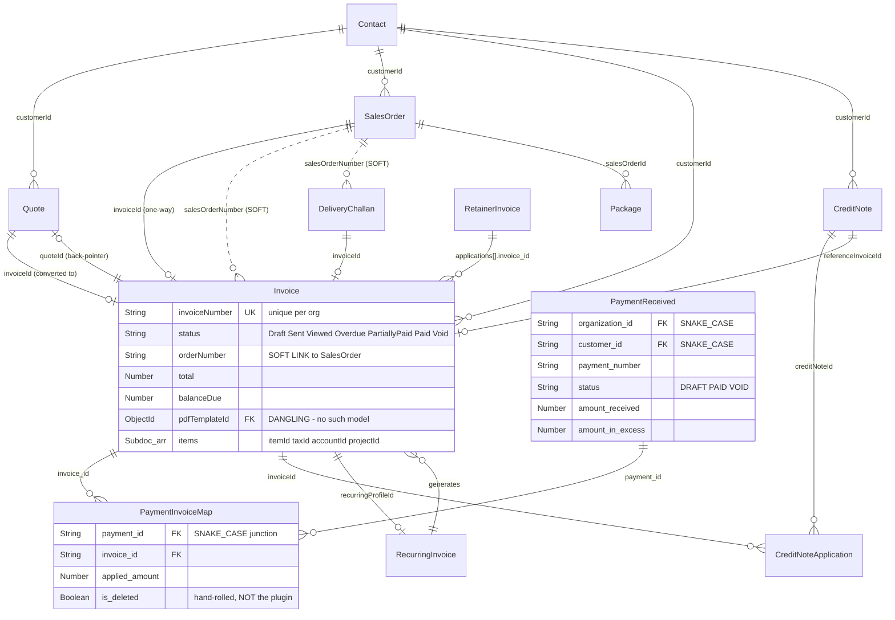
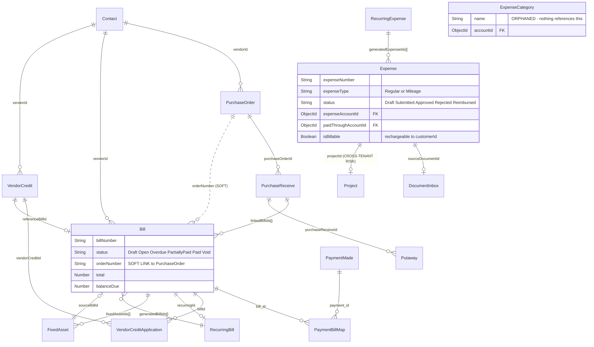
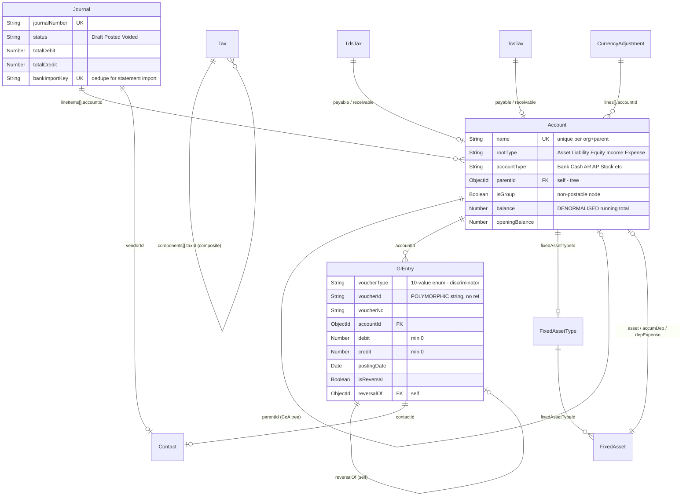
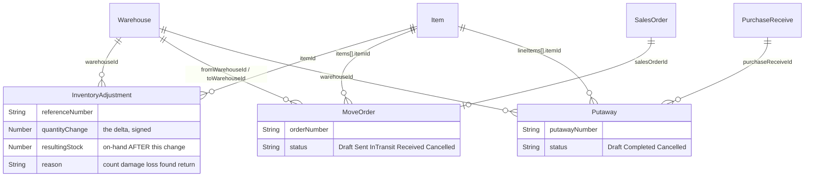
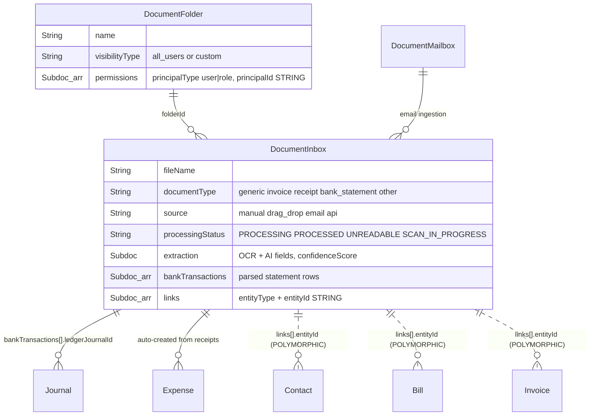
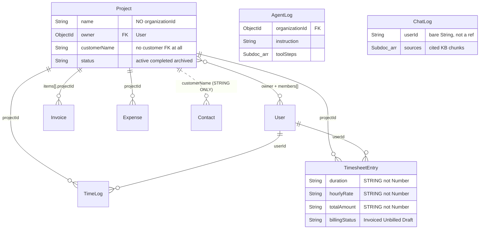

# HAI Accounting — Data Model Reference

Every collection, foreign key and hidden relationship in the platform, mapped from the Mongoose
schemas so a new team can build against it without reading all 61 model files.

| | |
|---|---|
| **Collections** | 61 (+1 stray) |
| **Datastore** | MongoDB / Mongoose |
| **Tenancy** | per-organization |
| **Source** | `backend/src/models` |
| **Ledger** | double-entry, immutable |

> This is a reverse-engineered map, not a designed spec — it documents what the code *does*,
> including the parts that are wrong. Sections 00 and 14 exist because several findings will
> change how you write queries on day one. Read those before writing anything.

**Diagrams render natively on GitHub.** Mermaid blocks can also be pasted into
[mermaid.live](https://mermaid.live) or imported into most modelling tools.

---

## Contents

- [00 · Read first](#00--read-first)
- [01 · Conventions](#01--conventions)
- [02 · System map](#02--system-map)
- [03 · The ledger mechanism](#03--the-ledger-mechanism)
- [04 · Core & identity](#04--core--identity)
- [05 · Master data](#05--master-data)
- [06 · Sales — order to cash](#06--sales--order-to-cash)
- [07 · Purchases — procure to pay](#07--purchases--procure-to-pay)
- [08 · Ledger, tax & fixed assets](#08--ledger-tax--fixed-assets)
- [09 · Inventory operations](#09--inventory-operations)
- [10 · Documents & banking](#10--documents--banking)
- [11 · AI assistant & project time](#11--ai-assistant--project-time)
- [12 · Soft links](#12--soft-links--relationships-the-schema-does-not-enforce)
- [13 · Entity index](#13--entity-index)
- [14 · Defect register](#14--defect-register)

---

## 00 · Read first

Four facts that invalidate the obvious assumptions about this schema.

### 🔴 Data loss — active in production

**Six collections spell tenancy `organization_id`, not `organizationId`** — `IdempotencyKey`,
`PaymentReceived`, `PaymentMade`, `RetainerInvoice`, `PaymentInvoiceMap`, `PaymentBillMap`. They
use snake_case throughout (`customer_id`, `bill_id`, `paid_through_account`).

`db.ts` sets `strictQuery: true`, which *silently strips* query paths absent from the schema.
`settings.controller.ts:451` builds `{ organizationId }` and calls `deleteMany(query)` against
`PaymentReceived`, `PaymentMade`, `RetainerInvoice`, `Project`, `TimeLog`, `TimesheetEntry` and
`Counter` — none of which have that path. The filter collapses to `{}`, so "reset my
organization's data" **deletes those seven collections for every tenant in the database**.

Only `PaymentInvoiceMap`, `PaymentBillMap` and `IdempotencyKey` were hand-special-cased with
`organization_id` and behave correctly. Any generic org-scoping helper keyed on the literal string
`"organizationId"` inherits this blind spot.

### 🟠 Half the foreign keys are invisible in the model files

`createdBy`, `updatedBy` and `deletedBy` are injected by schema plugins, not declared inline:
`auditTrailPlugin` adds two `User` refs to **43 schemas**, `softDeletePlugin` adds `deletedBy` to
**28**, and `activityLogPlugin` adds `activityLog[].userId` to three. That is roughly **117 extra
edges to `User`** that never appear in a grep for `ref:`.

`softDeletePlugin` also installs pre-hooks that append `isDeleted: {$ne: true}` to `find`,
`findOne`, `findOneAndUpdate` and `countDocuments` — but **not to `aggregate`, `distinct` or
`updateMany`**. Every reporting pipeline built on `$match` silently includes deleted rows.

### 🟠 The general ledger cannot be joined

`GlEntry.voucherId` is a plain `String` with no `ref`, discriminated at runtime by `voucherType`.
The same pattern appears on `DocumentInbox.links[].entityId`. Neither uses `refPath`, so neither
can be `populate()`d or `$lookup`-joined on ObjectId. Drilling from a ledger line back to its
source document needs a hand-written type→collection switch. See [§03](#03--the-ledger-mechanism).

### 🟠 Model registration is an import side effect

There is no `models/index.ts`. Models register only when some route or controller happens to
import them, so `mongoose.modelNames()` — and therefore the `syncIndexes()` loop in
`config/db.ts:52` — covers only what has already been loaded. A `populate()` into a
not-yet-imported model throws `MissingSchemaError` at runtime.

Relatedly: `plugins/organizationScoped.plugin.ts` exists and is exported, but is applied to
**zero** schemas. Every model hand-declares its tenancy field, which is exactly how the six
snake_case outliers above drifted apart.

---

## 01 · Conventions

### Naming

Model names are the string passed to `model("Name", schema)`, which is not always derivable from
the filename. Two traps:

| File | Registered as | Why it matters |
|---|---|---|
| `document.model.ts` | `DocumentInbox` | Collection is `documentinboxes`, not `documents`. Worse, `DocumentInbox` is *also* a TypeScript union type in the same file for the unrelated `inboxType` field. |
| `unit.model.ts` | `UnitOfMeasurement` | `ref: "UnitOfMeasurement"`, not `"Unit"`. |

### Relationship notation

| Mark | Meaning |
|---|---|
| `\|\|--o{` | One-to-many via a real `ObjectId` ref — populatable. |
| `\|\|..o{` | **Soft link.** Related by a number/code *string*, not an id. Not populatable; joins are string matches. These are real relationships the schema does not enforce. |
| `}o--o{` | Many-to-many, realised through a junction collection. |

To keep the diagrams readable, plugin-injected audit refs
(`createdBy`/`updatedBy`/`deletedBy` → `User`) and the near-universal `organizationId` →
`Organization` edge are **omitted from every domain diagram**. Assume both are present unless the
entity is marked *global*.

### Money and numbering

- Amounts are `Number` (floating point) on all accounting models — no decimal type. Rounding is
  done in application code via a shared `roundMoney` helper.
- Document numbers (`invoiceNumber`, `billNumber`, …) come from the `Counter` collection, whose
  `_id` is a composite string such as `invoice-<orgId>`. That composite key is the only reason
  `Counter` is tenant-safe despite having no org field.
- `TimesheetEntry` stores `duration`, `hourlyRate` and `totalAmount` as **Strings**, not Numbers.
  Arithmetic requires parsing.

---

## 02 · System map

Eight domains. Both trading cycles converge on one immutable ledger.

**Every financial event converges on `GlEntry`.** Both trading cycles reach it through the same
`postVoucher()` service rather than writing ledger rows themselves, and reports read only from the
ledger — never from document totals. That path must never be bypassed: a document saved without
its `postVoucher()` call is invisible to every financial report.

---

## 03 · The ledger mechanism

The single most important thing to understand before touching this codebase.

Business documents do not carry their own accounting. Posting is centralised in
`gl-posting.service.ts`, which validates that debits equal credits and then writes immutable
`GlEntry` rows. Corrections are made by writing further rows (`isReversal`, `reversalOf`), never by
editing.

**The forward path is enforced; the return path is not.** Posting is balanced and validated, but
the link from a ledger row back to its source is an unindexed-by-type string pair. That dashed edge
is the one you will have to implement yourself every time a report needs to drill through to a
document.

**Voucher types:** `Invoice · CreditNote · Bill · Expense · VendorCredit · PaymentMade ·
PaymentReceived · RetainerInvoice · Journal · System`

`voucherId` is stored as `<type>:<objectId>`, e.g. `invoice:665f…`. `Account.balance` is
additionally maintained as a denormalised running total, incremented alongside each posting — but
all financial *reports* aggregate `GlEntry` directly, so the two can drift without any report
noticing.

---

## 04 · Core & identity

*12 collections · the tenancy and configuration substrate*

`Organization` is the tenant root and the single most-referenced model (53 inbound refs). Note the
bootstrap cycle: `Organization.defaultAccounts.*` points at nine `Account` rows, while every
`Account` points back at its `Organization` — the org row must be inserted first, its accounts
created second, then the org updated.

> **🟠 Authorisation is weaker than it looks.** `User.roles` is `[String]` — plain names, not refs
> to `Role`. There is no foreign key from a user to a role anywhere; resolution is string matching
> in application code. And `Role.organizationId` is nullable, so global system roles and per-org
> roles share one collection with no partial unique index separating them. A role name reused
> across tenants resolves ambiguously.
>
> All tenant scoping derives from `User.activeOrganization`, read server-side. That part is sound —
> no client-supplied org id is ever trusted.

---

## 05 · Master data

*5 collections · shared by both trading cycles*

`Contact` is a unified customer/vendor record discriminated by `contactType` — there is no separate
Customer or Vendor collection. Both `GlEntry.contactType` and `Journal.lineItems[].contactType`
layer a Customer/Vendor/None discriminator over this single model.

`Item.stockOnHand` and `committedStock` are denormalised counters mutated by the sales and purchase
cycles; `InventoryAdjustment` is the audit trail that explains each change.
`Contact.outstandingReceivable` and `outstandingPayable` are likewise recomputed by a service rather
than derived on read.

---

## 06 · Sales — order to cash

*11 collections · Quote → SalesOrder → Invoice → PaymentReceived*

> **🟠 Two allocation ledgers, two deletion conventions.** Payment allocation lives in a separate
> junction collection, not on the invoice. `PaymentInvoiceMap` hand-rolls
> `is_deleted`/`deleted_at` and does **not** apply `softDeletePlugin` — so there is no automatic
> query filter. Callers must add `is_deleted: false` themselves or they double-count applied
> payments. `CreditNoteApplication`, by contrast, uses the plugin's `isDeleted` and filters
> automatically. Same job, opposite behaviour.

**Conversion is traceable forward but not backward.** `SalesOrder.invoiceId` and
`DeliveryChallan.invoiceId` point at the invoice, but `Invoice` has no `salesOrderId` field — only
the `orderNumber` string. Finding "which SO produced this invoice" is a string match, and it is
what the stock-deduction logic keys off.

---

## 07 · Purchases — procure to pay

*11 collections · mirrors the sales cycle*

> **🟠 Orphaned collection.** `ExpenseCategory` maps a category name to a GL account, but neither
> `Expense` nor `RecurringExpense` has an `expenseCategoryId` field. Nothing in the schema
> references it. It is a standalone lookup list today, not a live foreign key — either wire it up
> or drop it.

---

## 08 · Ledger, tax & fixed assets

*10 collections · `Account` is the second-biggest hub at 51 inbound refs*

Reports (`trialBalance`, `profitAndLoss`, `balanceSheet`) aggregate `GlEntry` by `accountId` and
`postingDate`, adding `Account.openingBalance`. They deliberately ignore `Account.balance` — which
is the correct design, and means that denormalised field is effectively decorative.

> **🔴 Depreciation never reaches the ledger.** The TypeScript union `GlVoucherType` includes
> `"FixedAsset"`, but the runtime Mongoose enum at `gl-entry.model.ts:44` omits it.
> `fixed-asset-depreciation.service.ts` posts with `voucherType: "FixedAsset"` at four call sites.
> Every one fails enum validation at save, so depreciation posts nothing — and TypeScript reports
> no error, because the union and the enum are declared separately in the same file.

---

## 09 · Inventory operations

*3 collections · driven by both trading cycles*

`InventoryAdjustment` is append-only and records `resultingStock` alongside the delta, so it
doubles as a reconstruction log for `Item.stockOnHand` — useful when the denormalised counter
drifts.

---

## 10 · Documents & banking

*3 collections · file ingestion, OCR and bank statement import*

> **🟠 The link enum is not a model list.** `DocumentInbox.links[].entityType` uses lowercase
> aliases — `expense · bill · purchase_order · sales_invoice · vendor · customer · account` — which
> do *not* match model names. `sales_invoice` maps to `Invoice`, and both `vendor` and `customer`
> map to the single `Contact` model. Any resolver needs an explicit alias table.
>
> `DocumentFolder.permissions[].principalId` is likewise a bare String pointing at either a `User`
> or a `Role` depending on `principalType`.

---

## 11 · AI assistant & project time

*6 collections · the weakest area of the schema*

> **🔴 Tenant isolation is missing here.** `Project`, `TimeLog` and `TimesheetEntry` carry **no
> organization field**. `routes/projects.ts` scopes list queries only by
> `{$or: [{owner: userId}, {members: userId}]}`, so a user who belongs to two organizations sees
> one merged project list. Worse, `Invoice.items[].projectId`, `Expense.projectId`,
> `RecurringInvoice.items[].projectId` and `RecurringExpense.projectId` can all point at a project
> owned by a *different tenant*, with nothing at the database or query layer preventing it.

> **ℹ️ KBChunk is not part of this database.** `kb-chunk.model.ts` registers lazily on a *separate*
> `mongoose.createConnection()` (a distinct chatbot cluster, falling back to
> `<mainUri>/chatbot_db`). It never appears in `mongoose.modelNames()`, is not covered by the
> `syncIndexes()` loop, cannot be populated or `$lookup`-ed from any main-connection document, and
> only exists after `getKBChunkModel()` is first called. Treat it as a separate datastore.

---

## 12 · Soft links — relationships the schema does not enforce

These behave like foreign keys in the business logic but are stored as strings. None can be
populated; all break silently if the referenced value is edited.

| From | Field | Matches | Consequence |
|---|---|---|---|
| `Invoice` | `orderNumber` | `SalesOrder.salesOrderNumber` | Drives whether stock is deducted. The only SO→Invoice trace that exists. |
| `DeliveryChallan` | `salesOrderNumber` | `SalesOrder.salesOrderNumber` | Same pattern on the fulfilment path. |
| `Bill` | `orderNumber` | `PurchaseOrder.purchaseOrderNumber` | Decides whether a bill re-applies stock already received. |
| `RecurringBill` | `orderNumber` | `PurchaseOrder.purchaseOrderNumber` | Inherited by every generated bill. |
| `VendorCredit` | `orderNumber` | `PurchaseOrder.purchaseOrderNumber` | — |
| `CreditNote` | `referenceOrderNumber` | `SalesOrder.salesOrderNumber` | — |
| `PurchaseReceive` | `purchaseOrderNumber` | `PurchaseOrder.purchaseOrderNumber` | Duplicates the real `purchaseOrderId` ref beside it. |
| `Putaway` | `purchaseReceiveNumber` | `PurchaseReceive.purchaseReceiveNumber` | Duplicates the real ref beside it. |
| `Organization` | `baseCurrency` | `Currency.code` | Currency is a global table joined by code, by design. |
| `Contact` | `currency` | `Currency.code` | Same. |
| `GlEntry` | `voucherId` | 10 possible models | Polymorphic. See [§03](#03--the-ledger-mechanism). |
| `DocumentInbox` | `links[].entityId` | 7 aliased types | Polymorphic with a non-model alias enum. |
| `Project` | `customerName` | `Contact.displayName` | No customer id exists anywhere on Project. |
| `TimesheetEntry` | `customerName` | `Contact.displayName` | Customer reporting depends on exact string equality. |
| `User` | `roles[]` | `Role.name` | The entire RBAC join. |

### Reference cycles

Populate depth guards and write-order care are needed on these.

- **Self-referencing:** `Account.parentId`, `ItemGroup.parentId`, `Contact.linkedContactId`,
  `Tax.components[].taxId`, `GlEntry.reversalOf`.
- **Bidirectional** (both sides stored, must be kept in sync): Organization ↔ Account,
  User ↔ Organization, Quote ↔ Invoice, Invoice ↔ RecurringInvoice, Bill ↔ RecurringBill,
  Expense ↔ RecurringExpense, Bill ↔ FixedAsset.

---

## 13 · Entity index

All 61 registered models, plus one that registers from outside the models directory.

| Model | Scope | Plugins | Purpose |
|---|---|---|---|
| `Account` | org | soft·audit | Chart-of-accounts node; the ledger head every posting hits. Tree via `parentId`. |
| `AgentLog` | org | — | One record per AI-agent run: instruction, answer, tool calls, duration. |
| `Bill` | org | soft·audit | Vendor bill (AP invoice) with lines, taxes and running balance due. |
| `ChatLog` | **global** | — | RAG chatbot Q&A with cited sources. `userId` is a bare String. |
| `Contact` | org | soft·audit | Unified customer/vendor master: GST profile, addresses, terms, outstanding balances. |
| `Counter` | **global** | — | Atomic document-number sequences. Tenant-safe only via composite `_id`. |
| `CreditNote` | org | soft·audit | Customer credit note; balance applies to invoices or is refunded. |
| `CreditNoteApplication` | org | soft·audit | Junction: how much of a credit note was applied to one invoice. |
| `Currency` | **global** | — | Global ISO currency reference. Joined by code string, never by id. |
| `CurrencyAdjustment` | org | audit | Period-end FX revaluation run and its per-account unrealised gain/loss. |
| `DeliveryChallan` | org | soft·audit | Goods delivery note against a sales order; convertible to invoice. |
| `DocumentFolder` | org | soft·audit | Folders for the document inbox with per-user/role permissions. |
| `DocumentInbox` | org | soft·audit | Uploaded/emailed files + OCR extraction + parsed bank rows. File is `document.model.ts`. |
| `DocumentMailbox` | org | audit | The tenant's inbound email address and secret token for document forwarding. |
| `ExchangeRate` | org | — | Per-org FX rate for a currency pair on a date. |
| `Expense` | org | soft·audit | Business expense (regular or mileage), optionally billable to a customer. |
| `ExpenseCategory` | org | audit | ⚠️ **Orphaned** — category→account lookup that nothing references. |
| `FixedAsset` | org | soft·audit | Capitalised asset with its own depreciation schedule and three GL accounts. |
| `FixedAssetType` | org | soft·audit | Reusable depreciation template (asset class) that assets inherit from. |
| `GlEntry` | org | audit | The immutable ledger line. One debit-or-credit row per account per voucher. |
| `IdempotencyKey` | ⚠️ **snake** | — | Dedupes retried mutations per org+scope, TTL 7 days. |
| `InventoryAdjustment` | org | audit | Append-only record of every stock delta and the resulting on-hand figure. |
| `Invoice` | org | soft·audit | The central A/R document. Payments, credit notes and retainers apply against it. |
| `Item` | org | soft·audit | Product/service master with pricing, tax, GL mappings and stock counters. |
| `ItemGroup` | org | — | Hierarchical item category tree. |
| `Journal` | org | audit | Manual journal voucher; also the target of bank-statement import. |
| `JournalNumberingPreference` | org | — | Per-org journal numbering scheme (auto prefix+counter, or manual). |
| `KBChunk` | ⚠️ **other DB** | — | Vector-searchable KB chunks with 768-dim embeddings. Separate connection. |
| `MoveOrder` | org | — | Inter-warehouse stock transfer with in-transit lifecycle. |
| `Organization` | **tenant root** | soft·audit | The tenant. Ownership, membership, locale, and nine default GL accounts. |
| `Package` | org | soft·audit | Packing slip: which SO quantities have been physically packed. |
| `PaymentBillMap` | ⚠️ **snake** | audit | Junction: allocates a PaymentMade amount to a Bill. Hand-rolled deletion flag. |
| `PaymentInvoiceMap` | ⚠️ **snake** | audit | Junction: allocates a PaymentReceived amount to an Invoice. Hand-rolled deletion flag. |
| `PaymentMade` | ⚠️ **snake** | audit | Outgoing vendor payment header; allocation lives in PaymentBillMap. |
| `PaymentMode` | org | — | Payment method (Cash, UPI…) optionally wired to a GL account. |
| `PaymentReceived` | ⚠️ **snake** | audit | Customer receipt header; allocation lives in PaymentInvoiceMap. |
| `PaymentTerms` | org | — | Net-30 style terms driving due-date calculation. |
| `PriceList` | org | audit | Per-currency price book overriding item rates for sales and/or purchases. |
| `Project` | ⚠️ **no tenant** | — | Billable client project. No org field — cross-tenant leak risk. |
| `PurchaseOrder` | org | soft·audit | PO raised to a vendor; receives and bills match against it. |
| `PurchaseReceive` | org | soft·audit | Goods receipt against a PO: what actually arrived, and which bills followed. |
| `Putaway` | org | soft·audit | Shelving of received goods into warehouse locations. |
| `Quote` | org | soft·audit·activity | Sales quotation, convertible to an invoice. |
| `RecurringBill` | org | soft·audit | Schedule + bill payload the scheduler clones into real Bills. |
| `RecurringExpense` | org | soft·audit | Schedule + expense template cloned into Expenses. |
| `RecurringInvoice` | org | soft·audit | Recurring billing profile generating Invoices on a schedule. |
| `ReportingTag` | org | audit | Dimensional label (cost centre, department) attachable to transactions. |
| `RetainerInvoice` | ⚠️ **snake** | audit | Customer advance tracked from receipt through application to invoices. |
| `Role` | org | — | Named permission set. `organizationId` nullable — system roles are global. |
| `SalesOrder` | org | soft·audit | Confirmed customer order driving invoicing, packing and shipment. |
| `SalesPerson` | org | audit | Sales rep for attribution and commission. |
| `Tax` | org | soft·audit | GST/sales tax rate: simple, group (composed) or compound. |
| `TcsTax` | org | soft·audit | Tax Collected at Source rate with payable/receivable accounts. |
| `TdsTax` | org | soft·audit | Tax Deducted at Source rate under an Income Tax section. |
| `TimeLog` | ⚠️ **no tenant** | — | Raw start/stop timer against a project. |
| `TimesheetEntry` | ⚠️ **no tenant** | — | Finalised billable work line. Money and duration stored as Strings. |
| `UnitOfMeasurement` | org | — | Unit of measure (pcs, kg, hrs). File is `unit.model.ts`. |
| `User` | **platform** | — | Firebase-backed login. `activeOrganization` drives all tenant scoping. |
| `VendorCredit` | org | soft·audit | Vendor-issued credit note applied against bills or refunded. |
| `VendorCreditApplication` | org | soft·audit | Junction: allocates vendor credit to a specific bill. |
| `Warehouse` | org | audit | Physical stock location with address and primary flag. |
| `NamingSeries` | ⚠️ **stray** | — | Registered in `utils/namingSeries.ts`, not the models directory. `generateName()` has zero callers — dead code that still registers and index-syncs. |

---

## 14 · Defect register

Schema-level defects found while mapping. Ordered by blast radius. None of these are stylistic.

| # | Defect | Location | Severity |
|---|---|---|---|
| 1 | **Cross-tenant deletion.** `strictQuery` strips `organizationId` from `deleteMany` filters on the six snake_case collections, reducing them to `{}`. The org-reset endpoint wipes seven collections for every tenant. | `settings.controller.ts:451–511` | 🔴 critical |
| 2 | **Depreciation never posts.** `voucherType: "FixedAsset"` is in the TS union but absent from the runtime enum, so all four depreciation postings fail validation silently. | `gl-entry.model.ts:14` vs `:44` | 🔴 critical |
| 3 | **No tenant isolation on projects.** `Project`/`TimeLog`/`TimesheetEntry` have no org field; invoices and expenses in one tenant can reference a project in another. | `Project.ts`, `routes/projects.ts` | 🔴 critical |
| 4 | **Soft-delete not applied to payment junctions.** `PaymentInvoiceMap`/`PaymentBillMap` hand-roll `is_deleted` with no query hook, so unfiltered reads double-count applied payments. | `payment-*-map.model.ts` | 🟠 high |
| 5 | **Aggregations see deleted rows.** `softDeletePlugin` hooks `find`/`findOne`/`findOneAndUpdate`/`countDocuments` but not `aggregate`, `distinct` or `updateMany`. | `plugins/softDelete.plugin.ts` | 🟠 high |
| 6 | **Dangling ref.** `Invoice.pdfTemplateId` declares `ref: "PdfTemplate"`, but no such model exists anywhere. Any `populate()` throws `MissingSchemaError`. Controllers always write `null`, so the feature is simply unbuilt. | `invoice.model.ts:113` | 🟡 medium |
| 7 | **Roles are unenforced strings.** `User.roles` is `[String]`; `Role.organizationId` is nullable with no partial unique index. Role names colliding across tenants resolve ambiguously. | `user.model.ts:39`, `role.model.ts:104` | 🟡 medium |
| 8 | **Index sync is incomplete.** No models barrel; `syncIndexes()` only covers models already imported by a loaded route. | `config/db.ts:52` | 🟡 medium |
| 9 | **Dead abstractions.** `organizationScoped.plugin.ts` applied to zero schemas; `NamingSeries` has zero callers but still registers. | `plugins/`, `utils/namingSeries.ts` | 🟢 low |
| 10 | **Orphaned collection.** `ExpenseCategory` is referenced by nothing. | `expense-category.model.ts` | 🟢 low |
