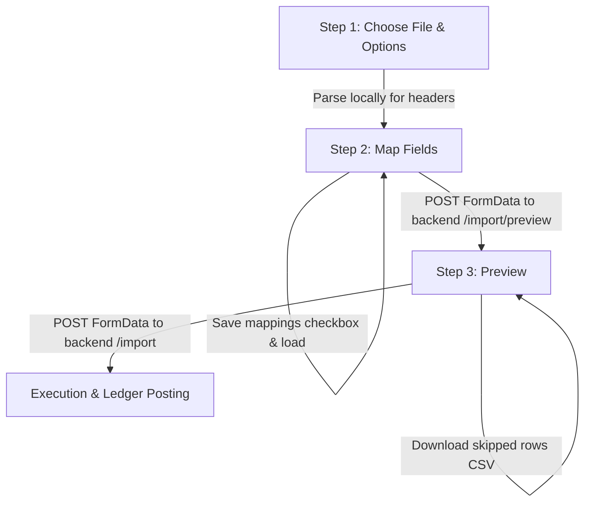

# Memory: Item CSV/Excel Import Wizard

This document details the configuration, parsing logic, duplicate handling, and UI layout of the multi-step Item Import Wizard.

## Architectural Flow

## 1. Field Mapping Layout (Step 2)

Mappings are grouped into five logical sections to replicate the Zoho Inventory layout:
1. **Item Details**: Item Name, SKU, Unit, Brand, Manufacturer, UPC, EAN, ISBN, Part Number, Product Type, Is Returnable.
2. **Sales Information**: Sales Desc, Selling Price, Sales Account.
3. **Purchase & Inventory Information**: Purchase Description, Purchase Price, Purchase Account, Inventory Account, Inventory Valuation Method, Reorder Level, Preferred Vendor, Opening Stock, Opening Stock Value, Opening Stock Rate, Is Receivable Service, Is Combo Product.
4. **Dimensions**: Package Weight, Package Length, Package Width, Package Height, Weight unit, Dimension unit.
5. **Tax Details**: Tax Name, Tax Type, Tax Percentage, Inter State Tax, Inter State Tax Type, Inter State Tax Percentage, Intra State Tax, Intra State Tax Type, Intra State Tax Percentage, Taxability, Exemption Reason, Warehouse Name.

### UI Features
- **Section Headings & Subheaders**: Each section renders with a bold title followed by a gray table subheader (`ZOHO INVENTORY FIELD` | `IMPORTED FILE HEADERS`) matching the screenshots.
- **Active Clear Buttons**: Select inputs with an active mapping render a red close (`X`) button absolute-positioned before the dropdown chevron to allow immediate clearance.
- **Auto-Mapping rules**: Detects matching headers case-insensitively, e.g. maps `inventoryvaluationmethod` to `valuationMethod` and `openingstockvalue` to `openingStockValue`.
- **Mapping persistence**: Selection maps are saved to the client's `localStorage` under `hai_item_import_mapping` if the user checks the "Save these selections for use during future imports" checkbox.

## 2. Parsing & Calculations (Backend)

The backend endpoint resolves sheet uploads in memory buffer using the `xlsx` library.

### Valuation Method
- Mapped value from `valuationMethod` is checked. If it contains `"fifo"` case-insensitively, it resolves to `"FIFO"`; otherwise, it defaults to `"MovingAverage"`.

### Opening Stock & Rate Calculation
- **Opening Stock** (`stockOnHand`) is parsed numerically.
- **Opening Stock Value** (`openingStockValue`) is parsed numerically.
- **Opening Stock Rate** (`averageCost`) is parsed:
  - If `averageCost` is not mapped but `openingStockValue` is present and `stockOnHand > 0`, the rate is calculated as `openingStockValue / stockOnHand`.
  - Fallback is set to the item's purchase price (`costPrice`).
- **Inventory Value** is computed and posted as `stockOnHand * averageCost`.

## 3. Duplicate Handling Policies

Duplicates are checked by case-insensitive `sku` (primary) and case-insensitive `name` (fallback).
- **Skip**: The item is omitted from database changes, marked as "Skip" with the reason "Row already exists" in the preview.
- **Overwrite**: Updates all fields on the existing item, updates audit trails, computes opening ledger adjustment differences, and posts adjustments to the General Ledger.

## 4. Preview & Skipped Audit Tracing (Step 3)

- **Server-side Row Number Tracking**: The backend `previewImport` endpoint attaches `rowNumber` (representing the 1-indexed row number of the sheet, i.e., `idx + 2`) to all preview records.
- **Audit Tables**: The skipped items list renders the correct `rowNumber` value (and exports the correct row number in the skipped CSV downloader) regardless of interleaved skipped and ready rows.
- **Unmapped Field Alerts**: Identifies any sheet headers not mapped to a fields key and warns the user in a bulleted list warning section.
