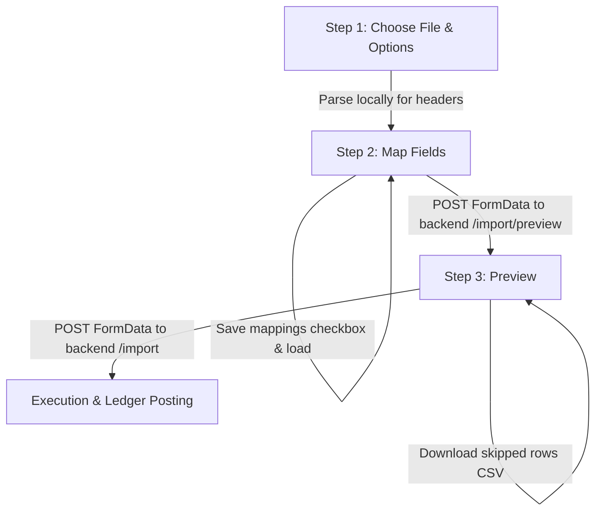
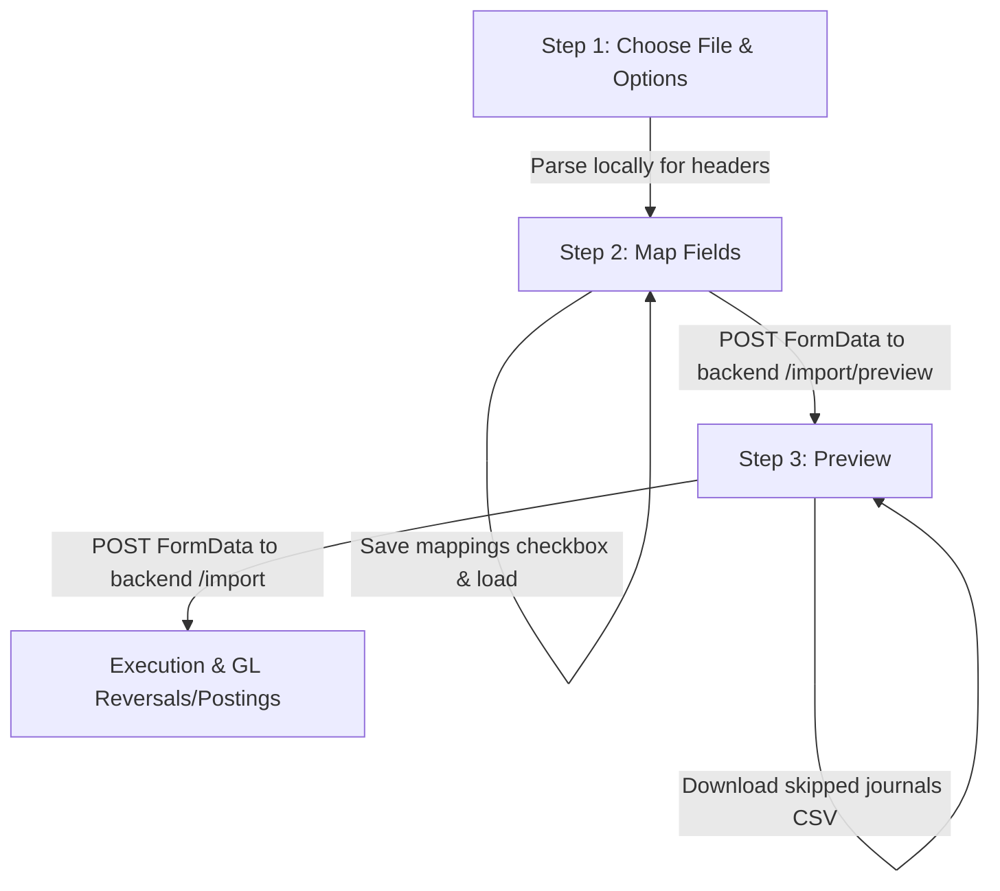

# Memory: Item CSV/Excel Import Wizard

This document details the configuration, parsing logic, duplicate handling, and UI layout of the multi-step Item Import Wizard.

## Architectural Flow

## 1. Field Mapping Layout (Step 2)

Mappings are grouped into five logical sections to replicate the Zoho Inventory layout:
1. **Item Details**: Item Name, SKU, Unit, Brand, Manufacturer, UPC, EAN, ISBN, Part Number, Product Type, Is Returnable.
2. **Sales Information**: Sales Desc, Selling Price, Sales Account.
3. **Purchase & Inventory Information**: Purchase Description, Purchase Price, Purchase Account, Inventory Account, Inventory Valuation Method, Reorder Level, Preferred Vendor, Opening Stock, Opening Stock Value, Opening Stock Rate, Is Receivable Service, Is Combo Product.
4. **Dimensions**: Package Weight, Package Length, Package Width, Package Height, Weight unit, Dimension unit.
5. **Tax Details**: Tax Name, Tax Type, Tax Percentage, Inter State Tax, Inter State Tax Type, Inter State Tax Percentage, Intra State Tax, Intra State Tax Type, Intra State Tax Percentage, Taxability, Exemption Reason, Warehouse Name.

### UI Features
- **Section Headings & Subheaders**: Each section renders with a bold title followed by a gray table subheader (`ZOHO INVENTORY FIELD` | `IMPORTED FILE HEADERS`) matching the screenshots.
- **Active Clear Buttons**: Select inputs with an active mapping render a red close (`X`) button absolute-positioned next to the dropdown chevron (using `right-9` on wrapper and `[&_[data-slot=select-value]]:pr-10` on select trigger wrapper to avoid overlap) to allow immediate clearance.
- **Auto-Mapping rules**: Detects matching headers case-insensitively, e.g. maps `inventoryvaluationmethod` to `valuationMethod` and `openingstockvalue` to `openingStockValue`.
- **Mapping persistence**: Selection maps are saved to the client's `localStorage` under `hai_item_import_mapping` if the user checks the "Save these selections for use during future imports" checkbox.

## 2. Parsing & Calculations (Backend)

The backend endpoint resolves sheet uploads in memory buffer using the `xlsx` library.

### Valuation Method
- Mapped value from `valuationMethod` is checked. If it contains `"fifo"` case-insensitively, it resolves to `"FIFO"`; otherwise, it defaults to `"MovingAverage"`.

### Opening Stock & Rate Calculation
- **Opening Stock** (`stockOnHand`) is parsed numerically.
- **Opening Stock Value** (`openingStockValue`) is parsed numerically.
- **Opening Stock Rate** (`averageCost`) is parsed:
  - If `averageCost` is not mapped but `openingStockValue` is present and `stockOnHand > 0`, the rate is calculated as `openingStockValue / stockOnHand`.
  - Fallback is set to the item's purchase price (`costPrice`).
- **Inventory Value** is computed and posted as `stockOnHand * averageCost`.

### Dynamic Excel Exporter
- Serves endpoints `/import/template/sample` and `/import/template/blank` with query parameters `?format=excel`.
- Reads standard CSV from disk, parses using `XLSX.readFile`, writes workbook to a dynamic `xlsx` binary buffer, and streams it back with the header MIME type `application/vnd.openxmlformats-officedocument.spreadsheetml.sheet`.

## 3. Client-Side Generic Parser

- The client uses the `xlsx` library to parse files locally in Step 1.
- Reads uploaded files as array buffers.
- Invokes `XLSX.read(data, { type: "array" })` to handle CSV, XLS, and XLSX sheets natively, extracting sheet headers and rows to populate fields dropdown menus dynamically.

## 4. Duplicate Handling Policies

Duplicates are checked by case-insensitive `sku` (primary) and case-insensitive `name` (fallback).
- **Skip**: The item is omitted from database changes, marked as "Skip" with the reason "Row already exists" in the preview.
- **Overwrite**: Updates all fields on the existing item, updates audit trails, computes opening ledger adjustment differences, and posts adjustments to the General Ledger.

## 5. Preview & Skipped Audit Tracing (Step 3)

- **Server-side Row Number Tracking**: The backend `previewImport` endpoint attaches `rowNumber` (representing the 1-indexed row number of the sheet, i.e., `idx + 2`) to all preview records.
- **Audit Tables**: The skipped items list renders the correct `rowNumber` value (and exports the correct row number in the skipped CSV downloader) regardless of interleaved skipped and ready rows.
- **Unmapped Field Alerts**: Identifies any sheet headers not mapped to a fields key and warns the user in a bulleted list warning section.

---

# Memory: Manual Journal CSV/Excel Import Wizard

This document details the configuration, parsing logic, validation checks, duplicate handling, and UI layout of the multi-step Manual Journal Import Wizard.

## Architectural Flow

## 1. Field Mapping Layout (Step 2)

Mappings are grouped into two logical sections:
1. **Journal Header Details**: Journal Number, Journal Date (Required), Reference Number, Description, Notes, Status, Contact/Vendor Name.
2. **Journal Line Details**: Account Name (Required), Debit (Required), Credit (Required), Line Narration.

### UI Features
- **Field Groups Header headings**: Fields are organized under two clear sections: `Journal Header Details` and `Journal Line Details` with subheader row (`HAI ACCOUNTING FIELD` | `IMPORTED FILE HEADERS`).
- **Clear Button**: Uses absolute positioning (`right-9`) and select padding offset (`[&_[data-slot=select-value]]:pr-10`) to render a red close (`X`) button next to select inputs with active mapping.
- **Auto-Mapping Rules**: Case-insensitively detects matching headers, e.g. `journaldate` to `date`, `referencenumber` to `referenceNumber`, and `accountname` to `accountName`.
- **Mapping Persistence**: Saved in client's `localStorage` under `hai_journal_import_mapping` on checkout.

## 2. Grouping, Lookups & Validation (Backend)

The backend handles Excel/CSV imports through grouped record mappings and relation checks:

### Multi-row Grouping Schema
- Multiple rows are grouped into a single manual journal.
- Grouping key priority: `journalNumber` (primary) -> `referenceNumber` (secondary) -> `date + description` (tertiary).

### Entity Lookups
- **Account Lookup**: Maps the text column `Account Name` to the `Account` collection. Resolves case-insensitively by `name`, exact `code`, or exact `accountNumber`.
- **Contact/Vendor Lookup**: Maps `vendorName` to the `Contact` collection. Resolves case-insensitively by `displayName` or `companyName`.

### Validation Rules
- **Double Entry Rule**: Total debits must equal total credits.
- **Line Count Rule**: A journal entry must contain at least 2 line items.
- **Value Constraints**: Debits and credits must be non-negative. A single line cannot have both debit and credit. Both debit and credit cannot be zero.

## 3. Duplicate Handling & Overwrite Safety

- **Skip**: Ignores duplicates and retains the existing database entry.
- **Overwrite**: Updates existing journal metadata and lines. If the existing journal is `Posted`, the backend automatically calls `reverseJournalLedger` to post general ledger reversal/cancellation entries first, updates the journal details, and then posts the new balance ledger entries (`postJournalLedger`).

## 4. Step 3 Preview & Expandable Lines Table

- **Inline Row Expansion**: In Step 3, clicking the chevron icon next to a journal row expands it to display a nested sub-table listing all double-entry line details: `Account`, `Narration`, `Debit (₹)`, and `Credit (₹)`.
- **Skipped Journals Exporter**: Generates a CSV file containing row number, journal number, reference, description, and validation error messages for auditing.

